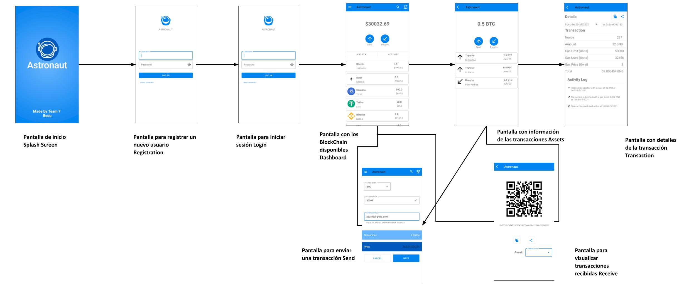

<h1> CryptoWallet </h1>

## ¿Qué es CryptoWallet?

Wallet de criptomonedas: Permite al usuario revisar su balance de diferentes criptomonedas en tiempo real además de enviar y recibir activos a través de las diferentes blockchains. También ofrece un registro en tiempo real de todas las transacciones realizadas con la cartera, tanto pagos como transferencias, donde puede ver información referente a la misma, como dirección a la que envía o recibe, blockchain a la que pertenece, fecha, y cantidad. Se planea que la cartera pueda conectarse con la blockchain de Bitcoin, Cardano, Ethereum y Binance Smart Chain. Asimismo se pretende que la cartera pueda comunicarse con los tokens ERC20, desplegados dentro de Ethereum y Binance Smart Chain, como por ejemplo ChainLink y Tether.

## ¡¡IMPORTANTE!!

Para poder usar esta aplicación es necesario registrarse con unas credenciales validas y contraseña MAYOR A 8 CARACTERES para despues poder usar ese usuario para iniciar sesion

## ¿Cual es el flujo normal de CryptoWallet?

En el siguiente diagrama de flujo se muestra la navegacion de la applicacion en un caso de uso real:

  

## Features

CryptoWallet es desarrollada usando tecnologías como:

- :iphone: **Kotlin**: El lenguaje de desarrollo utilizado para la construccion del proyecto fué Kotlin.

- :art: **XML**: La parte de diseño se utilizó el lenguaje de marcado XML.

- :gear: **Best Practices**: Flujo de trabajo sólido para mantener el código limpio y estructurado.

- :bulb: **Figma**: Vistas siguiendo las especificaciones para obtener una UI amigable para el usuario.

## ¿Cómo fué construído CryptoWallet?
Para la construcción de esta aplicación se implementaron todos los temas vistos en el Modulo de Kotlin Intermedio, y parte de Kotlin Avanzado, se siguieron las buenas prácticas y se realizaron los diseños correspondientes
a cada una de las pantallas en Figma, siguiendo los consejos y especificaciones del modulo de UI Fundamentals asi como los conocimientos adquiridos a lo largo del modulo de Kotlin fundamentals.
Este proyecto contiene temas como:
- Views (Constraint, LinearLayout, RelativeLayout, FrameLayout, etc)
- Activities y Layouts
- Listas
- Fragments
- Material Design
- Menus
- Styles
- Animaciones y transiciones
- Networking
- Acceso a Hardware
- Persistencia y Base de Datos

Tambien se hizo uso de algunas librerias externas, para mas referencias de estas se adjuntan algunos links

* https://github.com/airbnb/lottie-android
* https://material.io/design

## ¿Quienes mantienen y contribuyen a CryptoWallet?

|  Elias Bautista|  Paulina Quintero|  Carlos Segovia|  Ali Villegas ||
| --- | --- | --- | --- | --- |
| elias.bautistaflores@outlook.com | paulina.mucito@gmail.com | carlos.segovia2011@gmail.com | ali.villegas.aquino@gmail.com |

 

¡GRACIAS POR USAR CryptoWallet!
